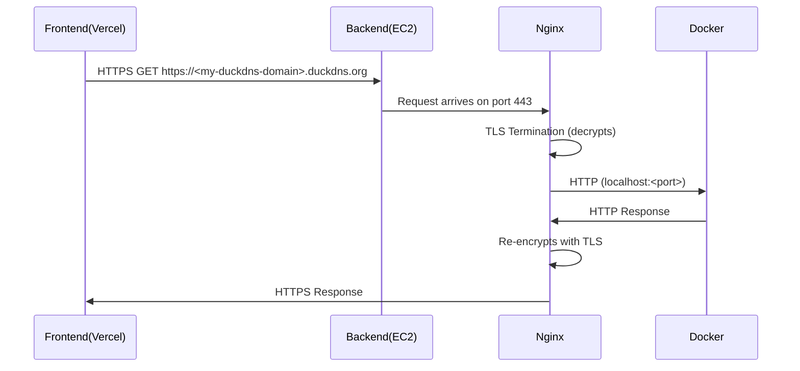

# Progress Tracker Backend

## The backend for a Reading Progress Tracker application

For our RESTful API, we have a Java/Javalin app running on an EC2 instance through a docker container connected to an AWS RDS MySQL instance.

## Technologies Used

### Java 17

Java is the primary programming language used for our RESTful API because for one, we were tasked with using Java and two, Java is a great middle ground between high-level languages like JavaScript and low-level languages like Rust where the language is simple to use (simple syntax, has a garbage collector) but also offers great performance through lower-level features such as memory management, multithreading and being a compiled language. Java also has the benefit of having a large community around it, creating a wide range of tools, libraries, frameworks, discussion and solutions around it.

### Javalin

We were tasked with creating a Java application that communicated with a MySQL database to store, retrieve and update data about users and a topic of our choice with the constraint that we needed to use raw SQL queries to do so with no ORM or JPA to manage our SQL for us. Given we weren't allowed to use Spring Hibernate or Spring Data JPA and how small of a project this was, I figured that Javalin could help us expose API endpoints to our frontend without the bulk of Spring. This allows enhanced performance and lower costs on AWS at the cost of having to manage the instantiation and configuration of our classes ourselves (which is quite manageable for this small of an API).

We use Javalin to instantiate our application and configure our CORS settings:

```java

 public static void main(String[] args) {
        var app = Javalin.create(config -> {
            CorsConfig.configure(config);
        }).get("/", ctx -> ctx.result("Hello World"))
                .start(EnvironmentConfig.PORT);
...
 }
```

We use Javalin to create our API endpoints and run our Middleware:

```java

public class AuthRoutes {

  public static void register(Javalin app) {
    AuthDAOImpl authDAO = new AuthDAOImpl();
    AuthController authController = new AuthController(authDAO);
    app.post("/api/auth/register", authController::register);
    app.post("/api/auth/login/username", authController::loginWithUsernamePassword);
    app.post("/api/auth/login/email", authController::loginWithEmailPassword);
    app.post("/api/auth/refresh", authController::refreshAccessToken);
  }
}

public class BookRoutes {
  public static void register(Javalin app) {
    BookDAOImpl bookDAO = new BookDAOImpl();
    BookController bookController = new BookController(bookDAO);
    app.before("/api/books", Middleware::requireAuth);
    app.before("/api/books/*", Middleware::requireAuth);
    app.before("/api/books/<id>", Middleware::requireAuth);
    app.get("/api/books", bookController::findAll);
    app.get("/api/books/<id>", bookController::findBookById);
    app.post("/api/books", bookController::save);
    app.delete("/api/books/<id>", bookController::delete);
    app.put("/api/books", bookController::update);
  }

}
```

Notice for routes that require authentication, we use a custom Middleware class (see /src/main/java/.../utils/Middleware.java) which Javalin runs before the request to check if the user provided a valid access token in the Authorization header and returns a 401 if not. We also utilize Javalin to configure CORS headers and global headers,

```java
public static void configure(JavalinConfig config) {
    config.bundledPlugins.enableCors(cors -> {
      cors.addRule(it -> {
        it.allowHost(EnvironmentConfig.FRONTEND_URL);
        it.allowCredentials = true;
        it.exposeHeader("Content-Type");
        it.exposeHeader("Set-Cookie");
        it.exposeHeader("Authorization");
        it.exposeHeader("X-Requested-With");
        it.exposeHeader("Accept");
        it.exposeHeader("Access-Control-Allow-Origin");
        it.exposeHeader("Access-Control-Allow-Credentials");
      });
    });
  }

  public static void configureGlobalHeaders(Javalin app) {
    app.before("/api/*", ctx -> {
      ctx.contentType("application/json");
      ctx.header("Access-Control-Allow-Origin", EnvironmentConfig.FRONTEND_URL);
      ctx.header("Access-Control-Allow-Credentials", "true");
      ctx.header("Access-Control-Allow-Methods", "GET, POST, PUT, DELETE, PATCH, OPTIONS");
      ctx.header("Access-Control-Allow-Headers", "Content-Type, Authorization, Cookie");
    });
  }
```

create cookies and manage sessions. We also use a separate package for creating and managing the JSON our Javalin endpoints receive on request and respond with.

### MySQL

We use MySQL as our relational database for storing, reading and updating data in development and production. In development, we use a locally installed MySQL Server and MySQL Workbench to manage our database. To provide our AWS RDS MySQL database with our schema and seed data in production, we need to access it from the EC2 instance since they are under the same VPC and security group. Once ssh'd into our EC2 instance we use a MariaDB instance locally installed to our EC2 instance (the official MySQL package isn't supported on AWS Linux) to communicate with our AWS RDS MySQL database to create the schema and seed the database. 

### AWS and Docker

#### The EC2 Instance

This was an EC2 instance I began using a few months ago with Docker already installed, which already has a separate Java Spring Boot API deployed on a separate Docker container. I simply built the image for my backend locally with `docker build -t backend .`, tagged it with `docker tag backend ghcr.io/dallasfoley/progress-tracker-backend:latest`, logged into ghcr.io ( with `docker login ghcr.io/dallasfoley` then provide Github PAT) then pushed it (`docker push ...`) to GitHub's container repository. Then ssh'd into the EC2 instance with the secret key given at creation of the EC2: `ssh -i ~/<path-to-private-key> <ec2-user@<ec2-instance-ip-address>`, logged into ghcr again, then pulled and ran the container:

```bash
docker login ghcr.io
docker pull ghcr.io/dallasfoley/progress-tracker-backend:latest
docker run -d --env-file .env -p 127.0.0.1:8081:8081 ghcr.io/progress-tracker-dallasfoley/backend:latest
```

In the above `docker run` call, our -d and --env-file flags run our container in detached mode, pass the path of .env file, respectively. We pass 127.0.0.1: as a prefix to our ports to only allow the container to be accessed through the EC2's localhost. Containers are managed with:

```bash
docker ps    # view running containers
docker stop <container_id>    #  stop a container
docker logs <container_id>    #  view a container's logs
docker exec -it <container_id> /bin/bash   #  access running container's shell for debugging
docker inspect <container_id>    #  view container configuration and networking info
```

#### The RDS Instance

We ensure that the AWS RDS MySQL instance is created under the same VPC and configure its available ports. To create our database schema, we first needed to copy the .sql file containing our schema to the EC2 instance with

```bash
scp -i ~/<path-to-private-key>.pem schema.sql ec2-user@<ec2-instance-ip-address>:/home/ec2-user
```

We then need to log in to our AWS MySQL instance through the EC2 instance

```bash
mysql -h <my-app-database>.xxxxxxxxx.us-east-1.rds.amazonaws.com -u <admin-username> -p
```

which will prompt us for our password and then give access to a MySQL terminal where we can run `source schema.sql` to give it our schema and seed it with data. (This could've been done in one less step, but is what it is.) We then just make sure all connection details are properly managed through our environment variables to allow our Javalin API to connect to the AWS MySQL database.

### NGINX

NGINX is a web server that has a variety of use cases. In our case, it acts as a reverse proxy which decrypts incoming HTTPS traffic from our frontend and routes it to the port our Docker container with our Java backend is running on and encrypts outgoing responses. We create the file and configure NGINX with:

```
sudo nano /etc/nginx/conf.d/reading-progress-tracker.conf
```

```.conf

server {
    listen 80;
    server_name <my-duckdns-url>.duckdns.org;
    return 301 https://$host$request_uri;
}

server {
    server_name <my-duckdns-url>.duckdns.org;
    location / {
        proxy_pass http://localhost:8081;
        proxy_set_header Host $host;
        proxy_set_header X-Real-IP $remote_addr;
        proxy_set_header X-Forwarded-For $proxy_add_x_forwarded_for;
        proxy_set_header X-Forwarded-Proto $scheme;
    }
    listen 443 ssl;
    ssl_certificate /etc/letsencrypt/live/<my-duckdns-url>.duckdns.org/fullchain.pem;
    ssl_certificate_key /etc/letsencrypt/live/<my-duckdns-url>.duckdns.org/privkey.pem;
    include /etc/letsencrypt/options-ssl-nginx.conf;
    ssl_dhparam /etc/letsencrypt/ssl-dhparams.pem;
}

```



In my case, it sits in a secure file in my `.conf` folder along with the NGINX config for a separate app, which are both loaded in by the main `.conf` file after

```bash
sudo systemctl reload nginx
```

### DuckDNS

This is a website that allows us to use a subdomain of their site for essentially a free domain. This allows us to not worry about our backend URL giving away any information about our EC2 instance, as NGINX decrypts HTTPS traffic to the URL DuckDNS gives us, which NGINX then reroutes to our Docker container running locally on the EC2 instance, running our Java app. It also allows us not to worry about paying for a domain for our backend, while a free-tier Vercel account allows a free https vercel subdomain for the BFF frontend; I'm also using AWS free-tier, so the frontend and backend are both deployed completely for free :D

### Certbot

Automates the process of obtaining and renewing Let's Encrypt certificates for websites, enabling HTTPS encryption (for subsequent NGINX decryption on request and NGINX encryption on response). Using `certbot --nginx -d <my-duckdns-domain>.duckdns.org`:

1. Certbot validates domain ownership
2. Downloads certificates and stores them in /etc/letsencrypt/
3. Modifies NGINX config to include SSL certificate paths
4. Reloads NGINX to apply changes
5. Sets up automatic renewal via cronjob

### HikariCP

HikariCP gives us a connection pool for MySQL, which allows us to manage multiple connections to the database at once and reuse them if possible, helping to optimize performance and resource usage.

### SLF4J

SLF4J is a logging framework that allows us to connect our System.out.println statements to a Java framework, in our case, Javalin.

### FasterXML/Jackson

FasterXML/Jackson is a Java library that allows us to convert Java objects to JSON and vice versa. This
is necessary for us to send and receive JSON data from our endpoints.

### Java JWT

Java JWT is a Java library that allows us to create and validate JWT tokens for user authentication and authorization.

## Overall Structure of the Entire Application

We have a Next.js application deployed through Vercel, which runs in the client's browser runtime environment as well as on a Node.js runtime environment through serverless functions (basically, AWS Lambda functions spin up managed EC2 instances where you don't need to interact manually with the server, and Vercel adds a layer abstraction on top of this to spin up AWS Lambda Functions through their platform). Our Next.js backend is connected to our Java/Javalin RESTful API deployed on an AWS EC2 instance through a Docker container, which is connected to our MySQL database managed by AWS RDS.
Javalin is our backend framework of choice for exposing API routes to our frontend. Given how small of an API this is (4 controllers, 4 DAOs, 3 tables in our SQL schema), it didn't seem necessary to include a service layer between our DAOs and controllers. Our main class creates our DAOs and controllers, configures our CORS, access headers, cookie headers and other headers while the
We utilize Next.js as a proxy layer between the client and the Javalin server, which allows us to keep all of the calls to the Javalin server on the server side which enhances security by hiding sensitive data from the client, validates and sanitizes all user inputs, etc. It also greatly enhances performance by allowing us to cache our statically rendered routes (technically caching their RSC Payload, we also cache the static components of our dynamically rendered routes through Next.js's experimental Partial Prerendering), caching our requests to the Javalin server with its Data Cache along with a few other caching layers detailed in the frontend README.md.

## Authentication and Authorization

### Authentication

We utilize JWTs stored in cookies passed back and forth from client to server. When the user logs in or signs up through a form, the request is sent through a Next.js server action to the Javalin server, which makes a call to the database through with HikariCP (to pool connections) to verify the given credentials. If successful, the Java backend will send back a successful response to the browser containing the user info, an httpOnly, secure cookie containing the encrypted access token and an httpOnly, secure cookie containing the encrypted refresh token. This is stored in the browser and attached to API calls to the backend in the Next.js proxy layer.

### Authorization

When a user makes a request to an API route that requires authentication, the Middleware class is run before the request and checks if the user has a valid access token in the Authorization header. If not, we return a 401 status code. When the Next.js proxy layer receives a 401 status code, it will attempt to call the /api/auth/refresh endpoint to get a new access token. If successful, the Next.js proxy layer will retry the request with the new access token, otherwise it will display an error message to the user and redirect them to the home page.
